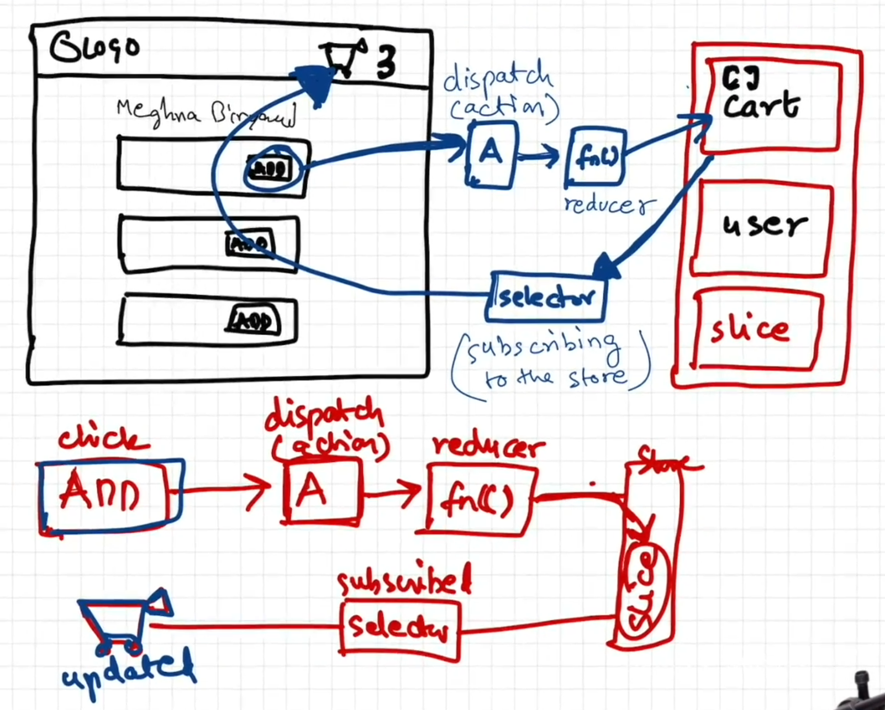

# Chapter 12 - Lets build our store (Redux)

## Coding Assignment:

*In this chapter, we will use @reduxjs/toolkit & react-redux which is the newer way of wrtting redux.* 

- npm install -D  @reduxjs/toolkit
- npm install react-redux

1. configureStore in appStore.js
2. createSlice in newFile.js
3. add slice reducer to the appStore
4. Provide the store to the root level with store={appStore}

- for add/delete from redux store:-
  const dispatch = useDispatch()
  dispatch(action())

- for get the data from redux store:-
  const variable = use useSelector(store => store.sliceName)

## Redux

Redux is a state management library for JavaScript applications, most commonly used with React. It provides a centralized store to manage application state in a predictable way.

We can assume Redux store is like big object kept in a global central space to manage application state.
Redux offers easy debugging.

### Redux Data Flow

#### Writing to the Store
1. User clicks a button
2. dispacth the action
3. Reducer function is called
4. update the slice of redux store.

#### Reading from the Store
1. Use useSelector() to subscribe to the store.
2. Component automatically re-renders when the selected slice changes.

### 🛠️ Core Concepts
  - Store – holds your entire app’s state.
  - Dispatch – sends actions to the store.
  - Actions – plain objects that describe what happened.
  - Reducers – pure functions that update state based on actions.
  - Selectors – retrieve parts of the state.

